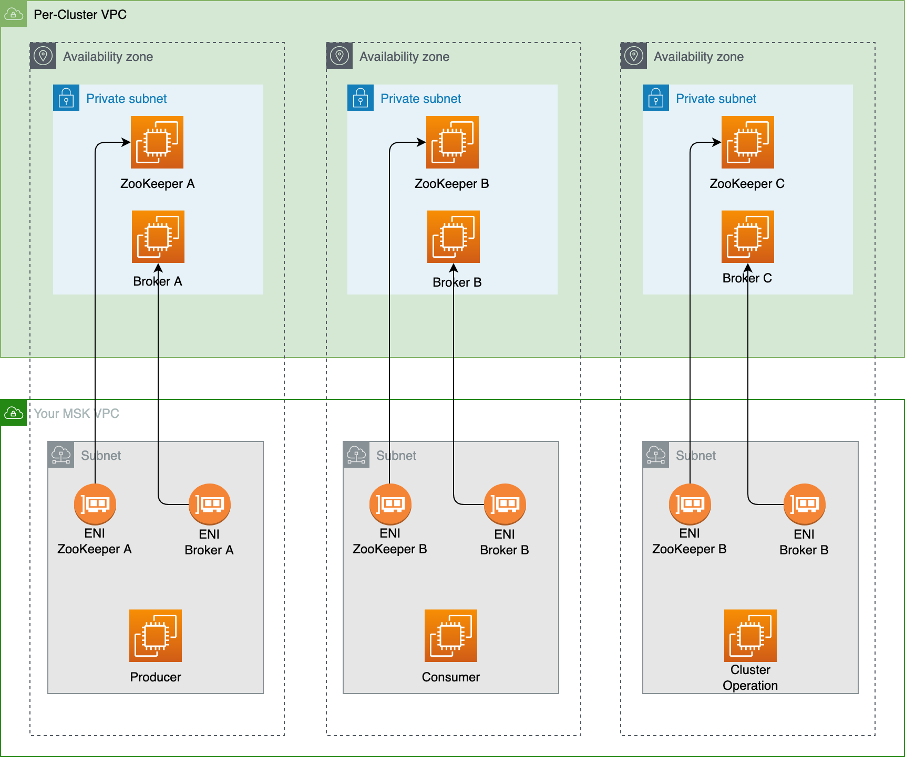
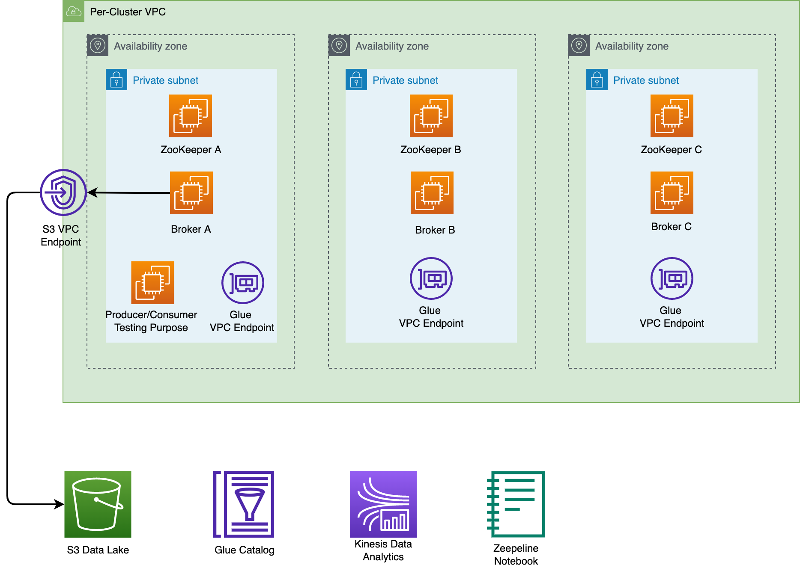
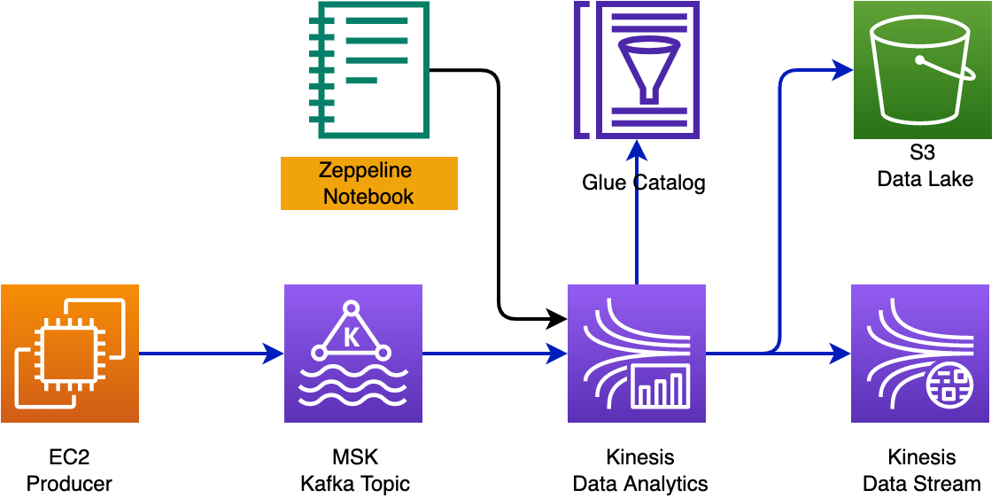
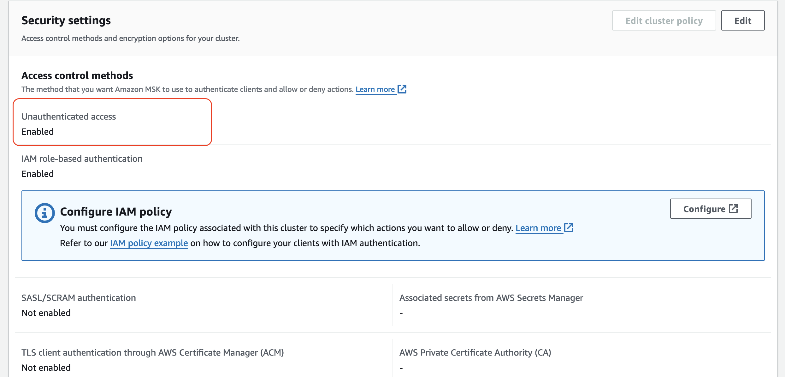
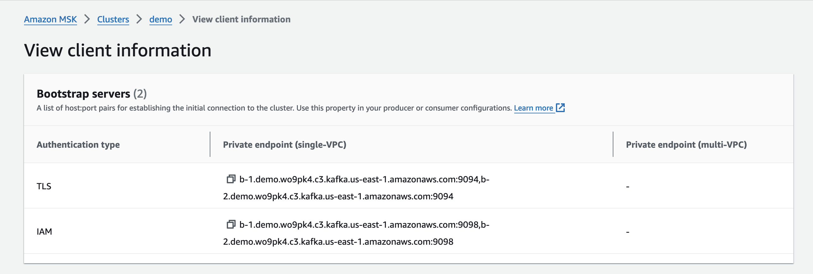

## Introduction

This [GitHub](https://github.com/cdk-entest/aws-msk-demo) shows basic architecture and examples with MSK and Kinesis Data Analytics (FLINK)

- Setup s3 vpc endpoint, glue vpc endpoint for msk
- Create a msk cluster
- Create client, pub/sub topic
- Update cluster configuration
- Create a zeppeline notebook
- Do some simple streaming analytics



## Setup Client

Setup permissions for client with the following policy, this policy apply for both

- EC2 for demo
- Zeppline notebook

```json
{
  "Version": "2012-10-17",
  "Statement": [
    {
      "Effect": "Allow",
      "Action": [
        "kafka-cluster:Connect",
        "kafka-cluster:AlterCluster",
        "kafka-cluster:DescribeCluster"
      ],
      "Resource": ["arn:aws:kafka:ap-southeast-1:1111222233334444:cluster/*"]
    },
    {
      "Effect": "Allow",
      "Action": [
        "kafka-cluster:*Topic*",
        "kafka-cluster:WriteData",
        "kafka-cluster:ReadData"
      ],
      "Resource": ["arn:aws:kafka:ap-southeast-1:1111222233334444:topic/*"]
    },
    {
      "Effect": "Allow",
      "Action": ["kafka-cluster:AlterGroup", "kafka-cluster:DescribeGroup"],
      "Resource": ["arn:aws:kafka:ap-southeast-1:1111222233334444:group/*"]
    }
  ]
}
```

Describe a cluster

```bash
export CLUSTER_ARN=
```

```bash
aws kafka describe-cluster --cluster-arn $CLUSTER_ARN
```

install java for EC2

```bash
sudo yum -y install java-11
```

then install

```bash
wget https://archive.apache.org/dist/kafka/2.8.1/kafka_2.13-2.8.1.tgz
```

download iam

```bash
wget https://github.com/aws/aws-msk-iam-auth/releases/download/v1.1.1/aws-msk-iam-auth-1.1.1-all.jar
```

create the client.properities file with below content

```bash
security.protocol=SASL_SSL
sasl.mechanism=AWS_MSK_IAM
sasl.jaas.config=software.amazon.msk.auth.iam.IAMLoginModule required;
sasl.client.callback.handler.class=software.amazon.msk.auth.iam.IAMClientCallbackHandler
```

put it together in userdata

## UserData

Use this userdata to configure an EC2 instance which connect to msk cluster

```bash
sudo yum -y install java-11
wget https://archive.apache.org/dist/kafka/2.8.1/kafka_2.13-2.8.1.tgz
tar -xvf kafka_2.13-2.8.1.tgz
cd kafka_2.13-2.8.1/libs/
wget https://github.com/aws/aws-msk-iam-auth/releases/download/v1.1.1/aws-msk-iam-auth-1.1.1-all.jar
cd ../bin/
echo 'security.protocol=SASL_SSL' >> client.properties
echo 'sasl.mechanism=AWS_MSK_IAM' >> client.properties
echo 'sasl.jaas.config=software.amazon.msk.auth.iam.IAMLoginModule required;' >> client.properties
echo 'sasl.client.callback.handler.class=software.amazon.msk.auth.iam.IAMClientCallbackHandler' >> client.properties
chmod 700 client.properties
```

## Pub and Sub



Check the msk client information to get endpoint and run below command to create an topic. Export the list of broker

```bash
export ENDPOINT="IAM_BOOTSTRAP_BROKERS_GO_HERE"
```

```bash
bin/kafka-topics.sh \
--create --bootstrap-server $ENDPOINT \
--command-config bin/client.properties \
--replication-factor 3 --partitions 3 \
--topic sensor-topic
```

list topic

```bash
bin/kafka-topics.sh \
--list --bootstrap-server $ENDPOINT \
--command-config bin/client.properties
```

describe a topic

```bash
bin/kafka-topics.sh \
--describe --bootstrap-server  $ENDPOINT \
--command-config bin/client.properties \
--topic sensor-topic
```

send a message to by using a producer

```bash
bin/kafka-console-producer.sh --broker-list \
$ENDPOINT \
--producer.config bin/client.properties \
--topic sensor-topic
```

receive message by using a consumer

```bash
bin/kafka-console-consumer.sh \
--bootstrap-server $ENDPOINT \
--consumer.config bin/client.properties \
--topic sensor-topic \
--from-beginning
```

## Producer Python

Please update the security of msk, for example for quickly testing, allow unauthorized access

```bash
pip install
```

then create a producer, please use the SSL BOOTSTRAP CLUSTER

```py
import datetime
import random
import time
import json
from confluent_kafka import Producer

# bootstrapserver
BOOTSTRAP_SERVERS ="SSL_BOOTSTRAP_CLUSTER"

# topic name
TOPIC = "stock-topic"

# callback delivery function
def delivery_report(error, message):
    """
    """
    if error is not None:
        print("GOOD")
    else:
        print(message)


# producer
producer = Producer({
    'bootstrap.servers': BOOTSTRAP_SERVERS,
    'security.protocol': 'SSL'
})

# send event to topic
while True:
  # create event
  event = {
        'event_time': datetime.datetime.now().isoformat(),
        'ticker': random.choice(['AAPL', 'AMZN', 'MSFT', 'INTC', 'TBV']),
        'price': round(random.random() * 100, 2)
    }
  # convert dict to byte
  data = json.dumps(event, indent=2).encode("utf-8")
  # send event to topic
  producer.produce(TOPIC, data, callback=delivery_report)
  time.sleep(1)
```

## Notebook



Please update the vpc configuration for notebook first, so it can access msk cluster inside a vpc.Then let create a table which connect to the kafka topic stream, please use the IAM BOOTSTRAP CLUSTER. From the producer please use correct datetime formate for event_time.

```py
'event_time': datetime.datetime.now().strftime("%Y-%m-%d %H:%M:%S.%f")
```

let create a table which connect to the kafka topic

```sql
%flink.ssql(type=update)

DROP TABLE IF EXISTS stock_stream;

CREATE TABLE stock_stream (
    ticker STRING,
    price DOUBLE,
    event_time  TIMESTAMP(3)
  )
WITH (
    'connector' = 'kafka',
    'topic' = 'stock-topic',
    'properties.bootstrap.servers' = 'b-2.democluster2.vidd98.c3.kafka.ap-southeast-1.amazonaws.com:9098,b-1.democluster2.vidd98.c3.kafka.ap-southeast-1.amazonaws.com:9098,b-3.democluster2.vidd98.c3.kafka.ap-southeast-1.amazonaws.com:9098',
    'properties.group.id' = 'KdaStudioGroup',
    'scan.startup.mode' = 'latest-offset',
    'format' = 'json',
    'properties.security.protocol' = 'SASL_SSL',
    'properties.sasl.mechanism' = 'AWS_MSK_IAM',
    'properties.sasl.jaas.config' = 'software.amazon.msk.auth.iam.IAMLoginModule required;',
    'properties.sasl.client.callback.handler.class' = 'software.amazon.msk.auth.iam.IAMClientCallbackHandler'
);
```

run a simple query

```sql
%flink.ssql(type=update)
SELECT * FROM stock_stream
```

create a sink table for writting to s3

```sql
%flink.ssql(type=update)
CREATE TABLE stock_output_table(
    ticker STRING,
    price DOUBLE,
    event_time TIMESTAMP(3))
    PARTITIONED BY (ticker)
WITH (
    'connector'='filesystem',
    'path'='s3a://data-lake-stream-20072023/kafka-data/',
    'format'='csv',
    'sink.partition-commit.policy.kind'='success-file',
    'sink.partition-commit.delay' = '1 min'
);
```

enable checkpoint

```sql
%flink.pyflink

st_env.get_config().get_configuration().set_string(
    "execution.checkpointing.interval", "1min"
)

st_env.get_config().get_configuration().set_string(
    "execution.checkpointing.mode", "EXACTLY_ONCE"
)
```

insert data into the sink table, in case of msk, need to setup s3 endpoint

```sql
%flink.ssql(type=update)
INSERT INTO stock_output_table
SELECT
    ticker,
    price,
    event_time
FROM stock_table
```

similarly, we can writ to json format by another table

```sql
%flink.ssql(type=update)
CREATE TABLE stock_output_table_json(
    ticker STRING,
    price DOUBLE,
    event_time TIMESTAMP(3))
    PARTITIONED BY (ticker)
WITH (
    'connector'='filesystem',
    'path'='s3a://data-lake-stream-20072023/kafka-data-json/',
    'format'='json',
    'sink.rolling-policy.rollover-interval' = '60s',
    'sink.rolling-policy.check-interval' = '30s'
);
```

then insert data into json table

```sql
%flink.ssql(type=update)
INSERT INTO stock_output_table_json
SELECT
    ticker,
    price,
    event_time
FROM stock_table
```

## Policy for Client

policy

```json
{
  "Version": "2012-10-17",
  "Statement": [
    {
      "Effect": "Allow",
      "Action": [
        "kafka-cluster:Connect",
        "kafka-cluster:AlterCluster",
        "kafka-cluster:DescribeCluster"
      ],
      "Resource": ["*"]
    },
    {
      "Effect": "Allow",
      "Action": [
        "kafka-cluster:*Topic*",
        "kafka-cluster:WriteData",
        "kafka-cluster:ReadData"
      ],
      "Resource": ["*"]
    },
    {
      "Effect": "Allow",
      "Action": ["kafka-cluster:AlterGroup", "kafka-cluster:DescribeGroup"],
      "Resource": ["*"]
    }
  ]
}
```

and policy to access kafka, glue

```json
{
    "Sid": "ReadGlue",
    "Effect": "Allow",
    "Action": [
        "glue:*"
    ],
    "Resource": [
        "*"
    ]
},
{
    "Sid": "ReadKafka",
    "Effect": "Allow",
    "Action": [
        "kafka:*"
    ],
    "Resource": [
        "*"
    ]
},
{
    "Sid": "AccessMSK",
    "Effect": "Allow",
    "Action": [
        "kafka-cluster:*"
    ],
    "Resource": [
        "*"
    ]
},
```

please double check below policy

```txt
CloudWatchFullAccess
CloudWatchLogsFullAccess
AmazonKinesisFullAccess
AmazonS3FullAccess
AWSGlueServiceRole
```

to access msk cluster inside an vpc we need to attach AmazonVPCFullAccess to the notebook

```txt
AmazonVPCFullAccess
```

Best practice policy with resource arn

```json
{
  "Version": "2012-10-17",
  "Statement": [
    {
      "Effect": "Allow",
      "Action": [
        "kafka-cluster:Connect",
        "kafka-cluster:AlterCluster",
        "kafka-cluster:DescribeCluster"
      ],
      "Resource": [
        "arn:aws:kafka:ap-southeast-1:111222333444:cluster/demo-cluster-1/*"
      ]
    },
    {
      "Effect": "Allow",
      "Action": [
        "kafka-cluster:*Topic*",
        "kafka-cluster:WriteData",
        "kafka-cluster:ReadData"
      ],
      "Resource": [
        "arn:aws:kafka:ap-southeast-1:111222333444:topic/demo-cluster-1/*"
      ]
    },
    {
      "Effect": "Allow",
      "Action": ["kafka-cluster:AlterGroup", "kafka-cluster:DescribeGroup"],
      "Resource": [
        "arn:aws:kafka:ap-southeast-1:111222333444:group/demo-cluster-1/*"
      ]
    }
  ]
}
```

## Troubeshooting

- ensure that notebook (inside vpc) can accessl glue catalog via nat or vpc endpoint
- update vpc configuration of notebook to access msk inside a cluster
- update role of the zeppeline notebook
- update security (allow unauthorized access) of msk
- double check name of stream

Describe a cluster

```bash
aws kafka describe-cluster --cluster-arn "CLUSTER_ARN"
```

## Troubleshooting

![IMPORTANT]

> Please take note the difference between IAM_BOOTSTRAP_BROKERS_GO_HERE and SSL_BOOTSTRAP_CLUSTER. For demo, let enable aunthentication



and client connection information



Install pip

```bash
python3 -m ensurepip --upgrade
```

Here is connection script via terminal

```bash
# export endpoint - iam
export ENDPOINT=""
export TOPIC=stock-topic

# create a topic
bin/kafka-topics.sh \
--create --bootstrap-server $ENDPOINT \
--command-config bin/client.properties \
--replication-factor 2 --partitions 1 \
--topic $TOPIC

# list topic
bin/kafka-topics.sh \
--list --bootstrap-server $ENDPOINT \
--command-config bin/client.properties

# describe topic
bin/kafka-topics.sh \
--describe --bootstrap-server  $ENDPOINT \
--command-config bin/client.properties \
--topic $TOPIC

# pub a topic
bin/kafka-console-producer.sh --broker-list \
$ENDPOINT \
--producer.config bin/client.properties \
--topic $TOPIC


# sub a topic
bin/kafka-console-consumer.sh \
--bootstrap-server $ENDPOINT \
--consumer.config bin/client.properties \
--topic  $TOPIC \
--from-beginning
```

## Reference

- [msk kafka to apache iceberg](https://github.com/aws-samples/aws-glue-streaming-ingestion-from-kafka-to-apache-iceberg/tree/main)

- [glue vpc endpoint](https://repost.aws/knowledge-center/glue-connect-time-out-error)

- [msk event source lambda](https://www.youtube.com/watch?v=JKvIypfEiok)

- [msk and kinesis data analytics](https://www.youtube.com/watch?v=2Qhc6ePu-0M)

- [msk and operations](https://www.youtube.com/watch?v=AUx5x_jrX6I)

- [msk connect](https://www.youtube.com/watch?v=KtECJViknCM)
